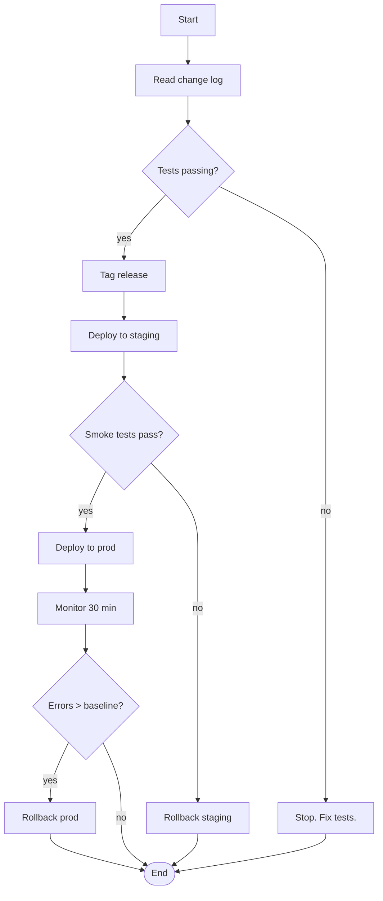
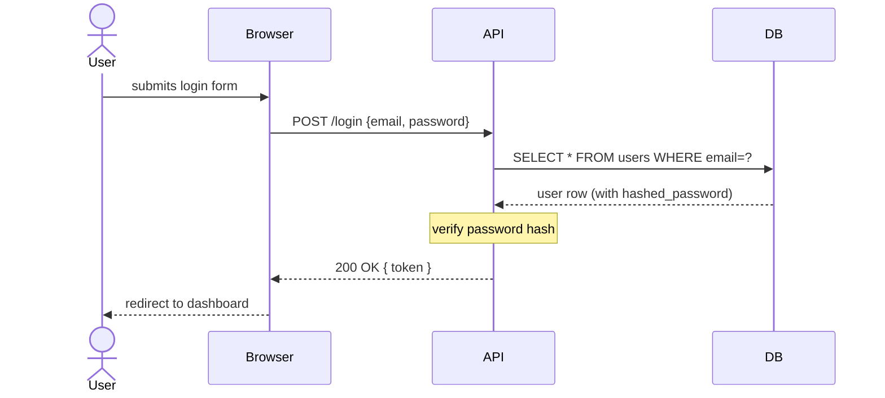
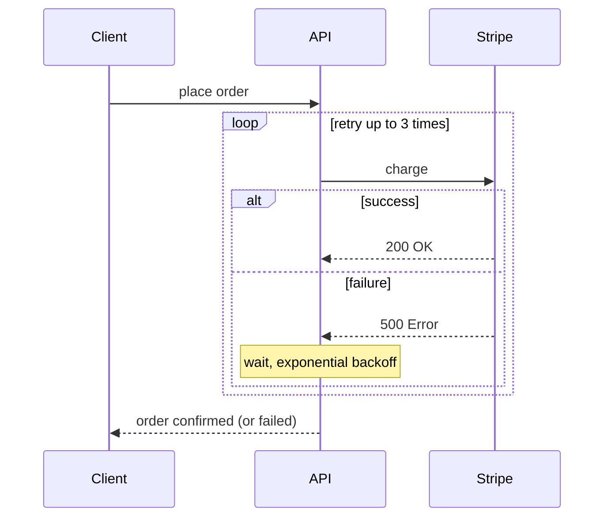
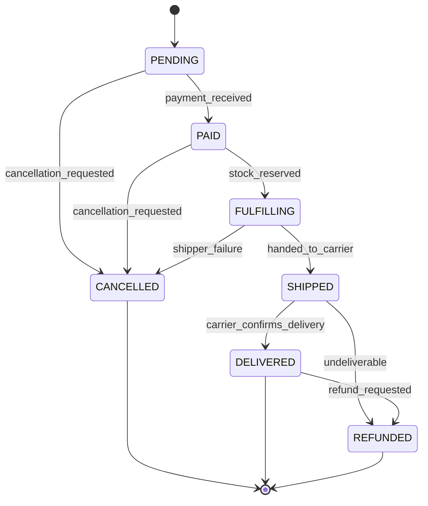
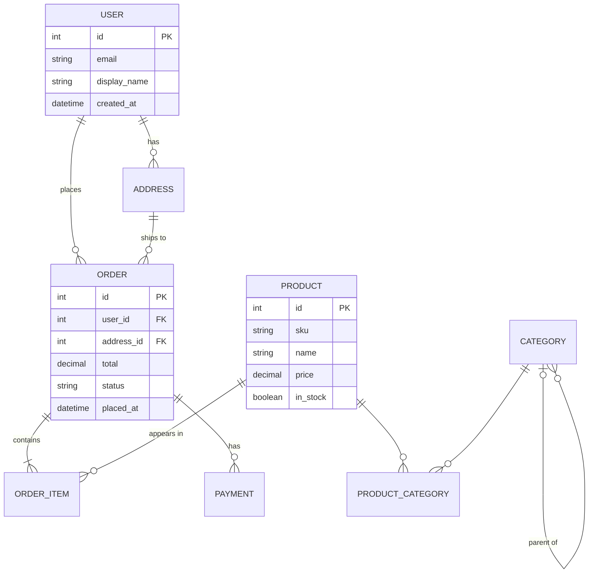

# Project: `wbd-mermaid-as-code`

> **Track:** Whiteboarding · **Project:** 6 of 9 · **Time:** ~75 minutes
>
> Hand-drawn diagrams disappear when the whiteboard gets erased. Mermaid diagrams live in git, render in GitHub's README, show up in PR descriptions, and diff cleanly when someone changes them. This project re-creates the four diagram types from projects #2-5 in Mermaid — proving the same engineering thinking works in code.

## Project goal

When this project is done, the learner can:

- Install the **Mermaid Markdown Preview** extension in VS Code and render diagrams locally.
- Write Mermaid syntax for **flowcharts** (`graph LR`), **sequence diagrams** (`sequenceDiagram`), **state diagrams** (`stateDiagram-v2`), and **ER diagrams** (`erDiagram`).
- Embed Mermaid in a GitHub README or PR description and have it render.
- Make the call between "draw on whiteboard" vs "write Mermaid" based on durability and audience.

## Scope guardrail

This is **4 diagram types translated to Mermaid + 1 embedded in a real markdown file + the version-control pitch**. We are not learning every Mermaid diagram type (Gantt, journey, mindmap, gitGraph — exist, rarely used). The point: own the 4 types you'll actually write 95% of the time.

If the learner asks "what about PlantUML or D2?" — answer honestly: *both excellent. Mermaid wins on portability — it renders natively in GitHub and VS Code without any extension on the reader's side. That's why we start here*.

## Prerequisites

| Prereq | Verify with |
|---|---|
| Completed `wbd-box-and-arrow-diagrams`, `wbd-sequence-diagrams`, `wbd-state-machines-and-flowcharts`, `wbd-entity-relationship-diagrams` (projects 2-5) — knows what each diagram type DOES | Can describe a state machine in plain English |
| VS Code installed | `code --version` works |
| A GitHub account (free) | Can sign in to github.com |

## Phases

### Phase 1 — Install + first render (~10 min)

**Goal:** Mermaid working in VS Code, with live preview.

**Steps:**

1. Open VS Code Extensions (`Ctrl+Shift+X`).
2. Search for `Markdown Preview Mermaid Support` (by Matt Bierner). Install.
3. Create a new file `hello-mermaid.md` with this content:
   ```markdown
   # Hello Mermaid

   ```mermaid
   graph LR
     A[User] --> B[App]
     B --> C[(Database)]
   ```
   ```
4. Open the markdown preview: `Ctrl+K V` (split preview) or `Ctrl+Shift+V` (full preview).
5. The Mermaid block should render as a diagram, not as code.

**Concepts to name out loud:**
- *This is **diagrams-as-code*** — the source of truth is the text. The picture is generated. Like writing CSS instead of designing pixel-by-pixel.
- *This is **why this works in GitHub too*** — GitHub's markdown renderer also runs Mermaid natively (since 2022). Push the same file, it renders in the README.
- *This is **the value: diffs*** — change the diagram, commit the change, the diff shows what changed. Hand-drawn diagrams committed as PNGs are unreadable diffs.

**Common gotchas:**
- Forgetting the `mermaid` after the opening triple-backtick → renders as plain code. The language tag matters.
- Using `Ctrl+Shift+P` → "Markdown: Open Preview" if the keybindings differ.
- VS Code's built-in markdown preview may not render Mermaid without the extension — the extension is what adds Mermaid support.

**After-action prompt:** *"You rendered your first Mermaid diagram. If you committed this file to a public GitHub repo, it would render in the README without anyone installing anything. That's the platform leverage."*

### Phase 2 — Flowchart syntax (~15 min)

**Goal:** Translate the deployment runbook from project #4 into Mermaid.

**Syntax reference:**



**Shape syntax:**

| Mermaid | Renders as |
|---|---|
| `A[ Rectangle ]` | rectangle |
| `B( Rounded )` | rounded rectangle |
| `C{ Diamond }` | diamond (decision) |
| `D[( Cylinder )]` | cylinder (database) |
| `E(( Circle ))` | circle (terminal in state diagrams) |
| `F([ Stadium ])` | pill / stadium (start/end) |
| `G[/ Parallelogram /]` | parallelogram |

**Arrow syntax:**

| Mermaid | Renders as |
|---|---|
| `A --> B` | solid arrow |
| `A -- label --> B` | labeled solid arrow |
| `A -.-> B` | dashed arrow (good for async) |
| `A -.- label -.-> B` | labeled dashed arrow |
| `A ==> B` | thick arrow (good for emphasis) |

**Direction:**

| Mermaid | Direction |
|---|---|
| `graph TD` (or TB) | top → bottom |
| `graph LR` | left → right |
| `graph BT` | bottom → top |
| `graph RL` | right → left |

**Drill:** create `runbook.md`, paste the deployment runbook Mermaid above, render it.

**Concepts to name out loud:**
- *This is **the same flowchart as project #4, but committable*** — the engineering content is identical. The medium is different.
- *This is **why `graph LR` for processes and `graph TD` for hierarchies*** — left-to-right matches reading direction for sequences; top-down matches mental models of hierarchies and decision trees. Pick the direction the audience expects.
- *This is **edge labels as the verb*** — same rule as project #2: every arrow has a verb. In Mermaid: `A -- "publishes event" --> B`.

**After-action prompt:** *"You rendered the runbook. If you committed it to your team's repo, would someone running a deployment three months from now find it? That's the durability win."*

### Phase 3 — Sequence diagram syntax (~15 min)

**Goal:** Translate the login flow from project #3 into Mermaid.

**Syntax:**



**Arrow types:**

| Mermaid | Means |
|---|---|
| `A->>B: msg` | solid arrow, filled head (synchronous call) |
| `A-->>B: msg` | dashed arrow (return / response) |
| `A->B: msg` | solid arrow, open head (async event) |
| `A-)B: msg` | open arrow, async (alternative syntax) |
| `Note over A: text` | note attached to a lifeline |
| `Note over A,B: text` | note spanning two lifelines |

**Loops and conditionals:**



**Drill:** translate the place-order with retry from project #3 phase 4 into Mermaid. Use `loop` + `alt`/`else`.

**Concepts to name out loud:**
- *This is **the loop and alt blocks as the formal version of "happy path then failure path"*** — Mermaid forces you to express the branching cleanly. Hand-drawn lets you fudge it.
- *This is **`Note over X` for self-messages*** — internal processing (like "verify hash") shown as notes is cleaner than self-arrows in Mermaid.

**After-action prompt:** *"You translated a sequence. Compare the Mermaid source to the hand-drawn version. Which is faster to draft? Which is easier to modify a week later?"*

### Phase 4 — State diagram + ER diagram syntax (~15 min)

**Goal:** Translate the order state machine (project #4) and e-commerce ER (project #5) into Mermaid.

**State diagram:**



- `[*]` = initial state (when from) or terminal (when to).
- Transitions: `STATE --> NEXT_STATE: event_name`.

**ER diagram:**



**Crow's foot in Mermaid:**

| Mermaid | Means |
|---|---|
| `\|\|` | exactly one |
| `\|o` | zero or one |
| `o\|` | zero or one (other end) |
| `\|{` | one or many |
| `}\|` | one or many (other end) |
| `o{` | zero or many |
| `}o` | zero or many (other end) |

(The above uses backslash-escaped pipes for the table; in actual Mermaid blocks just use plain `|`.)

**Drill:** render both diagrams. Compare against the hand-drawn versions from projects #4 and #5.

**Concepts to name out loud:**
- *This is **state machines as 2-line stanzas*** — Mermaid's syntax for state transitions is essentially `from --> to: event`. Three pieces of info per line. Hard to forget any.
- *This is **the ER diagram with attribute blocks*** — you can show attributes inline (`{ ... }`) which means the diagram is BOTH the schema overview AND the column list. One source of truth.

**After-action prompt:** *"You translated 4 diagram types into Mermaid. For each one, which version do you prefer — hand-drawn or Mermaid? Why? Be honest about which medium fits which audience."*

### Phase 5 — Embed in real markdown + the version-control pitch (~20 min)

**Goal:** Put a Mermaid diagram into a real README and feel the workflow.

**Steps:**

1. Create a brand-new folder `~/mermaid-demo/` and run `git init`.
2. Create `README.md`:
   ```markdown
   # Mermaid Demo

   This is a tiny project to show Mermaid in action.

   ## Architecture

   ```mermaid
   graph LR
     User[(User)] --> App
     App --> DB[(Postgres)]
     App --> Cache[(Redis)]
     App --> External(Stripe)
   ```

   ## How a request flows

   ```mermaid
   sequenceDiagram
     User->>App: GET /products
     App->>Cache: GET products:list
     alt cache hit
       Cache-->>App: products
     else cache miss
       App->>DB: SELECT * FROM products
       DB-->>App: rows
       App->>Cache: SET products:list
     end
     App-->>User: 200 OK
   ```
   ```
3. Commit it.
4. Push to a (new) public GitHub repo. View the README on github.com.
5. Modify one diagram in the README, commit, push. View the diff on the commit page — see the line-level change.

**The version-control pitch — talk through this out loud:**

- A whiteboard diagram lives 1 meeting. A photo of a whiteboard lives in a wiki and goes stale.
- A Mermaid diagram lives in git. It changes WITH the code. Reviewers see what changed.
- When a new engineer joins, the README diagram is current — because the team would have updated it when they updated the code (and the code review would have flagged it).

**Decision tree — when to use what:**

| Situation | Tool |
|---|---|
| Whiteboard session, brainstorming | Whiteboard / Excalidraw |
| In a meeting, sketching live | Whiteboard / Excalidraw |
| Architecture docs in the repo | **Mermaid** |
| Diagrams in a PR description | **Mermaid** (GitHub renders it natively) |
| Diagrams in a README | **Mermaid** |
| Diagrams in Confluence / Notion | Both support Mermaid blocks |
| Diagram with brand colors / cloud icons for an exec deck | Draw.io (project #7) |

**Concepts to name out loud:**
- *This is **the source-of-truth question*** — for any artifact, ask "where is the canonical version?" If the canonical version is on a whiteboard photo in a wiki, it's already stale. If it's in git, it's current.
- *This is **why Mermaid in README beats a "docs" folder full of PNGs*** — PNGs require an editor (Visio, Lucidchart, drawio). Most engineers don't have or don't open that editor. Mermaid is in the text they're already reading.
- *This is **the integration with PR review*** — when an architecture changes, the diagram in the PR description should change too. Reviewers can SEE the change. With PNGs, they can't.

**Common gotchas:**
- Indentation inside Mermaid blocks doesn't matter — but consistency helps readability.
- GitHub renders Mermaid in README and issues / PRs / discussions, but NOT in older comments before 2022 — old issues won't backfill.
- Mermaid syntax errors render as an error block — useful for catching mistakes, but copy-pasted Mermaid from blogs sometimes has invisible characters that break the parser.

**After-action prompt:** *"You committed a diagram to GitHub. If your team starts doing this, three things change: PRs become richer, READMEs become living docs, and the whiteboard becomes the brainstorm tool — not the source of truth. Which of these would help your current project most?"*

## When to break the method

- Learner already uses PlantUML or D2 → great, similar mental model. Spend less time on syntax, more on Phase 5 (the workflow integration).
- Learner is on a team that uses Confluence/Notion → mention that both support Mermaid blocks. They don't need a separate tool.
- Time short → phases 1-2-5 are the must-do. Phases 3 and 4 reinforce.

## Definition of done

Observable, the learner can:

- [ ] Render a Mermaid diagram in VS Code's markdown preview.
- [ ] Write Mermaid for all 4 diagram types: flowchart, sequence, state, ER.
- [ ] Embed Mermaid in a README and view it rendered on github.com.
- [ ] Pick correctly between "whiteboard now" vs "Mermaid in repo" for 5 scenarios.
- [ ] Explain in one sentence each: diagrams-as-code, source-of-truth question, why-PR-review-becomes-richer.

## Next project

→ [`wbd-drawio-for-polished-diagrams`](../wbd-drawio-for-polished-diagrams/SKILL.md) — Mermaid is great for engineering audiences but limited on polish. When you need cloud-provider icons, brand colors, or a diagram for an executive deck, you reach for Draw.io. Learn when each tool wins.
